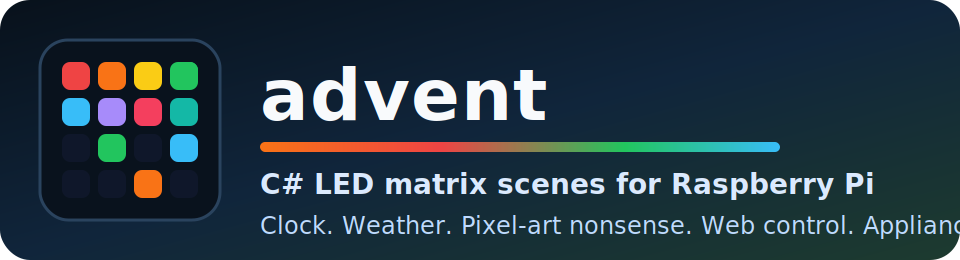

# advent

[](https://github.com/random-name-1234/advent/actions/workflows/ci.yml)
[](https://github.com/random-name-1234/advent/blob/main/LICENSE.txt)
[](https://dotnet.microsoft.com/)
[](https://github.com/random-name-1234/advent)

`advent` is a C#-first LED matrix scene runner for Raspberry Pi.

It started life as a festive matrix display and gradually picked up a few extra hobbies: clocks, weather, pixel-art chaos, message overlays, rail boards, web control, and just enough automation to behave like a tiny appliance.

If you like the idea of a 64x32 RGB panel acting somewhere between "seasonal art installation" and "tiny control room", this repo is for you.

## Highlights

- C# all the way down for app logic and rendering
- works on both Raspberry Pi 4 and Raspberry Pi 5
- simulator mode for development on macOS/Linux without touching real hardware
- image-driven scenes from checked-in assets and local-only private overlays
- a lightweight LAN web UI for scene control and message injection
- appliance-friendly deployment with GitHub Actions and `systemd`

## Scene Sampler

Out of the box, `advent` can rotate through things like:

- weather cards
- snowfall and rainbow snowfall
- Santa in December
- cat mode
- Donkey Kong
- Space Invaders
- Bonkers Parade
- Synthwave Grid
- Orbital
- Fireworks
- image scenes from your own files
- an optional UK rail board scene

There is also a `--test-mode` that runs the full catalogue in sequence instead of picking seasonal scenes at random.

## Backends

| Backend | Stack | Notes |
| --- | --- | --- |
| `pi4` | local bindings over [`rpi-rgb-led-matrix`](https://github.com/hzeller/rpi-rgb-led-matrix) | expects `librgbmatrix.so` next to the app |
| `pi5` | [`Pi5MatrixSharp`](https://github.com/random-name-1234/Pi5MatrixSharp) | bundled native runtime, Pi 5 friendly |
| `simulator` | terminal framebuffer preview | great for hacking on scenes locally |

The app currently assumes a `64x32` render target even though the Pi 5 backend can support broader geometry options underneath.

## Quick Start

### Simulator

```bash
dotnet run -c Release --no-launch-profile -- --simulator
```

### Simulator test mode

```bash
dotnet run -c Release --no-launch-profile -- --simulator --test-mode
```

### Pi 5

```bash
ADVENT_MATRIX_BACKEND=pi5 \
ADVENT_PI5_PINOUT=AdafruitMatrixBonnet \
dotnet run -c Release --no-launch-profile -- --backend=pi5
```

### Pi 4

```bash
dotnet run -c Release --no-launch-profile -- --led-slowdown-gpio=4 --led-gpio-mapping=adafruit-hat
```

### Pi 4 test mode

```bash
dotnet run -c Release --no-launch-profile -- --led-slowdown-gpio=4 --led-gpio-mapping=adafruit-hat --test-mode
```

## Private Images Without Public Repo Regret

Checked-in image scenes live in `advent-images/`.

Private, personal, or employer-specific assets should live in `advent-images.local/`, which is:

- loaded automatically when present
- ignored by git
- compatible with the same folder layout and `manifest.json` format

That means you can keep custom banners, logos, and one-off local scenes on your Pi or dev machine without smuggling them into the public repo.

A starter manifest is included at [`advent-images.local.example/manifest.json`](advent-images.local.example/manifest.json).

You can also add extra image roots with:

- `ADVENT_EXTRA_IMAGE_DIRECTORIES`

## Image Scene Rules

- files in `advent-images/` are available all year
- files in `advent-images/<month>/` only load in that month
- `.gif` files become animated scenes
- wide static images become scrolling banner scenes
- other static images become fade-in/out scenes

Manifest overrides support:

- `file`: relative image path
- `name`: custom scene name
- `type`: `auto`, `animated`/`gif`, `static`, or `scroll`
- `months`: month whitelist (`1-12`)
- `durationSeconds`: custom duration, capped at `20`

## Web Control

The app exposes a simple control UI on:

- `http://<pi-hostname-or-ip>:8080`

Useful endpoints:

- `GET /api/scenes`
- `GET /api/status`
- `POST /api/scene/play` with `{ "name": "Fireworks" }`
- `POST /api/scene/next`
- `POST /api/message/show` with `{ "text": "Dinner in 5", "durationSeconds": 8 }`
- `POST /api/mode` with `{ "mode": "normal" | "test" }`
- `POST /api/queue/clear`

Web UI environment variables:

- `ADVENT_WEB_ENABLED` (`true` by default)
- `ADVENT_WEB_BIND` (`0.0.0.0` by default)
- `ADVENT_WEB_PORT` (`8080` by default)
- `ADVENT_WEB_TOKEN` (optional but strongly recommended on a real network)

## Pi 5 Notes

Pi 5 support comes from [`Pi5MatrixSharp`](https://www.nuget.org/packages/Pi5MatrixSharp/), which wraps the Adafruit PioMatter path in a C#-friendly API.

Useful Pi 5 settings:

- `ADVENT_MATRIX_BACKEND=pi5`
- `ADVENT_PI5_PINOUT=AdafruitMatrixBonnet` or `Active3`
- `ADVENT_PI5_ADDR_LINES=4`
- `ADVENT_PI5_SERPENTINE=true`
- `ADVENT_PI5_ORIENTATION=Normal`
- `ADVENT_PI5_PLANES=10`
- `ADVENT_PI5_TEMPORAL_PLANES=2`

## Pi 4 Notes

Pi 4 uses local bindings in [`MatrixApi/`](MatrixApi/) over [`rpi-rgb-led-matrix`](https://github.com/hzeller/rpi-rgb-led-matrix).

If you need to rebuild the native library on the Pi:

```bash
./scripts/rebuild-librgbmatrix.sh
```

Optional overrides:

- `RGBMATRIX_REF=<branch-or-tag>`
- `RGBMATRIX_REPO_URL=<git-url>`

## Optional Scene Configuration

Weather scene:

- `ADVENT_WEATHER_LATITUDE`
- `ADVENT_WEATHER_LONGITUDE`

UK rail board scene:

- `ADVENT_RAIL_ENABLED`
- `ADVENT_RAIL_LDB_BASE_URL`
- `ADVENT_RAIL_LDB_CONSUMER_KEY`
- `ADVENT_RAIL_LDB_CONSUMER_SECRET`
- `ADVENT_RAIL_LDB_AUTH_HEADER_NAME`
- `ADVENT_RAIL_LDB_AUTH_HEADER_VALUE`
- `ADVENT_RAIL_LDB_USERNAME`
- `ADVENT_RAIL_LDB_PASSWORD`
- `ADVENT_RAIL_ORIGIN_CRS` (`ADVENT_RAIL_CAMBRIDGE_CRS` still works)
- `ADVENT_RAIL_DESTINATION_CRS` (`ADVENT_RAIL_LONDON_CRS` and `ADVENT_RAIL_KINGS_CROSS_CRS` still work)
- `ADVENT_RAIL_ORIGIN_LABEL` (optional)
- `ADVENT_RAIL_DESTINATION_LABEL` (optional)

The rail env var names are legacy from the original corridor this scene targeted; the scene itself is now just a configurable corridor board.

## Appliance / Pi Deploy

This repo includes a GitHub Actions deployment path aimed at a self-hosted runner living on the Pi itself.

Included workflows:

- `.github/workflows/ci.yml`: build and test
- `.github/workflows/deploy-pi.yml`: manual Pi deploy

Deploy flow:

1. publish the app for `linux-arm64`
2. stage source and app output into `~/advent-next-*`
3. promote them into `~/advent-*`
4. write or refresh `/etc/systemd/system/advent.service`
5. restart the service

By default the installed service runs as the self-hosted runner user, not `root`.

One-time setup checklist:

1. Register the Pi as a self-hosted runner with labels `self-hosted`, `linux`, `arm64`, `advent`.
2. Ensure the runner user has passwordless `sudo` for the `systemctl` work this deploy needs.
3. Put machine-local secrets in `/etc/advent/advent.env`.
4. Protect the `advent-pi` GitHub environment so deploys require approval.
5. Keep the repo on manual deploys only for the Pi workflow.

Useful repo variables:

- `ADVENT_LED_ARGS`
- `ADVENT_SERVICE_UNIT`
- `ADVENT_SERVICE_USER`
- `ADVENT_SERVICE_GROUP`
- `ADVENT_SERVICE_SUPPLEMENTARY_GROUPS`
- `ADVENT_ENV_FILE`
- `ADVENT_STABLE_APP_DIR`
- `ADVENT_STABLE_SRC_DIR`
- `ADVENT_NEXT_APP_DIR`
- `ADVENT_NEXT_SRC_DIR`

Recommended secret file shape:

```bash
sudo install -d -m 700 -o root -g root /etc/advent
sudo sh -c 'umask 077; cat > /etc/advent/advent.env <<EOF
ADVENT_RAIL_LDB_CONSUMER_KEY=put-the-api-key-here
ADVENT_RAIL_LDB_CONSUMER_SECRET=optional-consumer-secret
ADVENT_RAIL_ORIGIN_CRS=CBG
ADVENT_RAIL_DESTINATION_CRS=KGX
ADVENT_RAIL_ORIGIN_LABEL="Cambridge"
ADVENT_RAIL_DESTINATION_LABEL="London Kings Cross"
EOF'
sudo chown root:root /etc/advent/advent.env
sudo chmod 600 /etc/advent/advent.env
```

## Development

Validate the checked-in assets and manifest references with:

```bash
./scripts/validate-assets.sh
```

The simulator is usually the fastest way to iterate on scene timing, layout, and legibility before moving to real hardware.

## Why This Repo Exists

Because writing C# for a Raspberry Pi LED matrix is more fun than it has any right to be.
