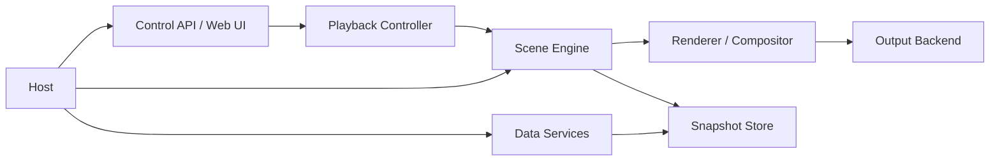

# advent Architecture Proposal

This is the "if we were starting again today" version of `advent`.

It is not a pitch for a ground-up rewrite. The point is to describe the system we actually have now:

- a render loop
- a scene scheduler
- timed and untimed scenes
- transitions and overlays
- background data from web APIs
- a control API and web UI
- multiple output backends
- appliance-style deployment on Raspberry Pi

The current app works. That matters. This document exists because the code is now solving a wider problem than it was originally designed for, and that wider problem deserves a clearer shape.

## Why Revisit The Design

`advent` started as a scene runner for a matrix display. It now also does:

- scene queueing and random scheduling
- scene timing and transitions
- compositing the clock over or under scenes
- deferred activation while remote data is loading
- HTTP calls for weather and rail data
- web control and REST endpoints
- deployment as a Pi appliance
- support for Pi 4, Pi 5, and a simulator

Those are all reasonable features. The problem is that several of them currently meet in the same places:

- [`Program.cs`](../Program.cs)
- [`Scene.cs`](../Scene.cs)
- [`SceneSelector.cs`](../SceneSelector.cs)
- [`FadingScene.cs`](../FadingScene.cs)
- [`WeatherScene.cs`](../WeatherScene.cs)
- [`RailBoardScene.cs`](../RailBoardScene.cs)
- [`ControlWebHost.cs`](../ControlWebHost.cs)

That coupling is why small changes can feel surprisingly expensive:

- adding a transition can affect clock behavior
- adding a data-backed scene can affect queue behavior
- changing a provider can affect scene activation
- hardware concerns and app concerns share the same host process shape

## Design Goals

If we were building for today's requirements, the system should optimize for:

1. Scenes are mostly renderers, not mini-app hosts.
2. Data fetching happens in the background, not on the scene activation path.
3. Transitions and overlays are engine features, not scene-specific hacks.
4. Output backends are adapters, not part of scene logic.
5. Web control talks to an application service, not directly to runtime objects.
6. A scene can be reasoned about without understanding the whole host.
7. The appliance can report what it is doing, not just accept commands.

## Proposed Runtime Shape

At a high level, the app should be split into five responsibilities.



### 1. Host

The host should be a normal `.NET` generic host that wires together:

- render loop
- web app
- background fetch services
- configuration
- logging
- output backend

This replaces the current "everything spins up from `Main()` and then the loop runs forever" style with a more explicit application host.

### 2. Scene Engine

The engine owns playback. It should decide:

- what is active
- what is queued
- what transition is happening
- which overlays are visible
- when a scene is eligible to start
- when a scene is done

The scene engine should be the only place that knows about:

- `queued`
- `playing`
- `transitioning`
- `idle`
- `skipped`

Right now, some of those ideas are split across [`Scene.cs`](../Scene.cs), [`SceneControlService.cs`](../SceneControlService.cs), [`TimedScene.cs`](../TimedScene.cs), and [`FadingScene.cs`](../FadingScene.cs).

### 3. Data Services

Weather and rail should be fetched by background services on their own cadence.

Scenes should not make web requests.

Instead, scenes should receive the latest available snapshot from a store such as:

- `IWeatherSnapshotStore`
- `IRailSnapshotStore`

That changes the behavior model from:

- "activate scene, wait for HTTP, maybe skip"

to:

- "if fresh data exists, show the scene"
- "if stale data exists, decide whether to show stale data with an age marker"
- "if no data exists yet, do not schedule the scene"

This removes the need for most deferred activation logic.

### 4. Renderer / Compositor

Rendering should be split into:

- scene rendering
- transition rendering
- overlay rendering

That means:

- the clock is an overlay
- snow is an overlay
- crossfade is a compositor transition
- rail page swipe is a scene-local animation

This is an important distinction.

A scene-local animation is part of the scene's own design. A transition is what the engine does when entering or exiting the scene.

### 5. Output Backend

The output layer should remain behind a simple abstraction like [`IMatrixOutput.cs`](../IMatrixOutput.cs), but the rest of the app should think in terms of a framebuffer or render target rather than hardware.

Backends:

- Pi 4 via `rpi-rgb-led-matrix`
- Pi 5 via `Pi5MatrixSharp`
- simulator

The host picks the backend. Scenes never care.

## Proposed Domain Model

The main conceptual change is this:

- a `scene definition` is not the same thing as a `scene instance`

Suggested model:

### `SceneDefinition`

Static metadata:

- id
- display name
- tags or category
- scheduling policy
- default duration
- preferred transition
- required capabilities

Examples:

- `weather`
- `uk-rail-board`
- `space-invaders`
- `static-image:ctm-banner`

### `SceneInstance`

Runtime object created for playback:

- `Start()`
- `Update(delta)`
- `Render(surface)`
- `IsComplete`

This instance should only contain runtime state for that one playback.

### `SceneDescriptor`

A playback request:

- scene id
- reason it was scheduled
- explicit duration override
- priority
- whether it may interrupt

This makes queued web-triggered scenes, random scenes, and test-mode scenes all look like the same scheduling primitive.

### `TransitionDescriptor`

Explicit transition behavior:

- `Cut`
- `Crossfade`
- `SwipeLeft`
- `SwipeRight`

Most scenes should use `Crossfade`.
Some scenes can opt out.
Internal scene paging, like the rail board swipe, should stay inside the scene itself.

## Scheduling Model

The scheduler should own these decisions:

- random rotation
- test-mode cycling
- manual queue
- interruption rules
- eligibility rules for data-backed scenes

Suggested responsibilities:

### `ISceneCatalog`

Knows what scenes exist and how to create them.

This replaces the current mix of definition, loading, seasonal filtering, and image scanning in [`SceneSelector.cs`](../SceneSelector.cs).

### `ISceneScheduler`

Chooses what should play next.

It should understand:

- random seasonal rotation
- queue priority
- test mode
- scene cooldowns
- data-backed scene readiness

### `IPlaybackController`

Accepts commands from the web/API layer:

- queue scene
- queue message
- skip current
- clear queue
- set mode

This is close to what [`SceneControlService.cs`](../SceneControlService.cs) already does, but it should talk to an engine-level scheduler rather than a queue on the scene container.

## Data Model

The biggest cleanup opportunity is the data-backed scenes.

### Current Model

`WeatherScene` and `RailBoardScene` each contain:

- fetch logic
- caching
- data transformation
- readiness logic
- rendering

That makes them harder to test and harder to reason about.

### Proposed Model

Split each into three parts:

1. Provider
   - knows how to call the remote API
   - maps responses into an internal snapshot model

2. Snapshot Store
   - keeps latest good data
   - tracks timestamp and freshness
   - exposes the last fetch error for status/debugging

3. Scene Renderer
   - only knows how to render a snapshot

Example:

- `DarwinRailProvider`
- `RailSnapshotStore`
- `RailBoardRenderer`

and:

- `OpenMeteoWeatherProvider`
- `WeatherSnapshotStore`
- `WeatherCardRenderer`

## Overlays And Transitions

This is the part that has caused the most visible weirdness.

If we were redesigning now, overlays and transitions would be explicit subsystems.

### Overlays

Examples:

- clock
- snow
- debug banner
- status badge

An overlay should have:

- visibility rules
- z-order
- render method

That avoids the current "does the scene hide time, does the fade hide time, does the clock crossfade here or there" style of coupling.

### Transitions

Transitions should be driven by the engine and applied consistently across all scene types.

A transition should know:

- outgoing scene
- incoming scene
- progress
- whether overlays are under or over the transition

Default rule:

- scene crossfades over the clock
- outgoing scene fades out while clock fades back in underneath

That matches the behavior you were aiming for.

## Control Plane

The web UI and REST API should be thin.

They should not need to know about scene internals. They should call application services and read back status objects.

Suggested API concepts:

- `PlaybackStatus`
- `QueuedSceneStatus`
- `DataSourceStatus`
- `OutputStatus`

Useful state to expose:

- current scene
- next queued scenes
- current mode
- output backend
- last successful weather refresh
- last successful rail refresh
- last fetch error per provider

That would have made the recent rail debugging much easier than reading `journalctl` and inferring behavior from queue length.

## Suggested Project Layout

If we were splitting by responsibility, the clean end state might look like this:

```text
src/advent.Host/
src/advent.Engine/
src/advent.Scenes/
src/advent.Data/
src/advent.Output/
src/advent.Web/
tests/advent.Tests/
```

That said, we do not need to split into multiple projects immediately.

A pragmatic intermediate step is:

```text
advent/
  Engine/
  Scenes/
  Data/
  Output/
  Web/
  Assets/
```

Keep one `.csproj`, but stop organizing by historical accident.

## Migration Plan

This is the important bit. We should move toward the design in slices.

### Phase 1: Introduce Clear Boundaries

- create `Engine`, `Data`, `Output`, and `Web` folders or namespaces
- move the current backend code behind a slightly richer output abstraction
- move weather and rail DTO/provider logic out of the scene files

Current status:
- largely completed in the current refactor pass

Low risk. Mostly structural.

### Phase 2: Background Data Services

- create hosted background refresh services for weather and rail
- create snapshot stores with freshness metadata
- change scenes to render snapshots instead of fetching them

Current status:
- hosted refresh services and snapshot stores are now in place
- freshness metadata is still a good follow-up improvement

This should eliminate most scene activation waiting and most scene skips.

### Phase 3: Scene Engine Cleanup

- replace queue ownership inside [`Scene.cs`](../Scene.cs) with a dedicated playback engine
- move transition logic out of scene wrappers and into engine-level playback state
- treat overlays as first-class render components

Current status:
- playback and rendering are now split
- overlays and transition rendering have explicit seams
- deeper engine-level transition state could still evolve further later

This is where the architecture meaningfully improves.

### Phase 4: Catalog And Scheduling

- make scene metadata explicit
- separate random scheduling from manual queueing
- let data-backed scenes declare readiness through the scheduler instead of self-skipping

Current status:
- readiness-aware scheduling and module-driven catalog registration are now in place

### Phase 5: Better Status And Diagnostics

- expose active scene and transition state via the API
- expose per-provider health and last refresh time
- expose output backend and render fps

This makes the Pi appliance much easier to operate.

## What I Would Not Rewrite

Some parts already point in the right direction:

- [`IMatrixOutput.cs`](../IMatrixOutput.cs)
- [`MatrixOutputFactory.cs`](../MatrixOutputFactory.cs)
- the Pi 4 / Pi 5 backend split
- the web control concept
- the asset-driven image scene approach

Those are good foundations.

## Short Version

If we were designing `advent` today, we would build it as:

- a host
- a playback engine
- background data services
- a compositor
- output adapters
- a thin control plane

Scenes would mostly render state.
They would not fetch their own data.
Transitions would belong to the engine.
Overlays would be explicit.
The web API would report real runtime state.

That is the direction worth refactoring toward.
